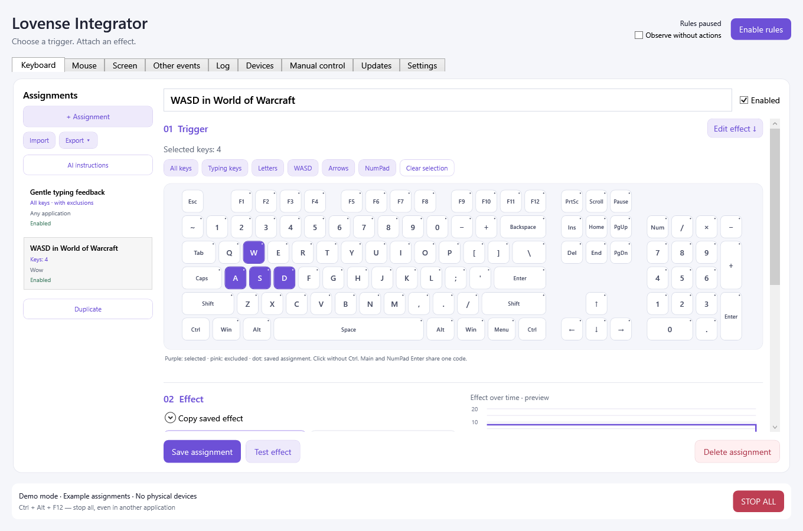
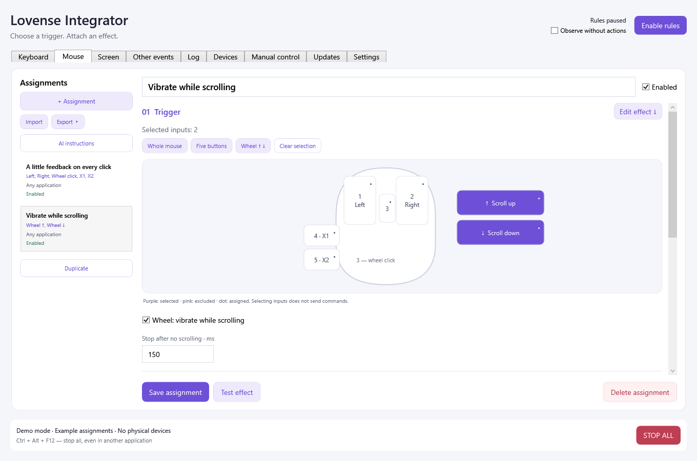
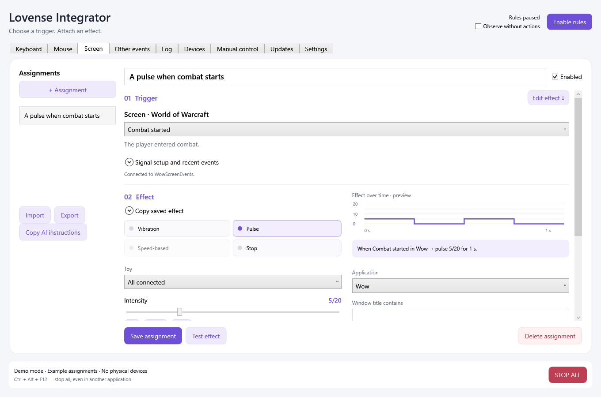
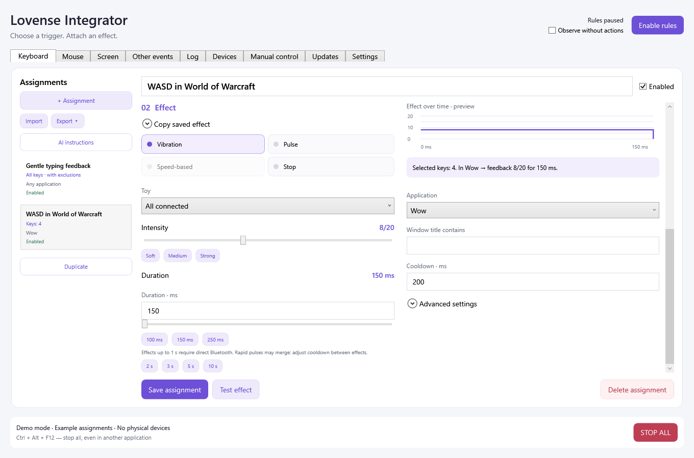

# Lovense Integrator

**Turn your keystrokes, clicks and game events into Lovense feedback.**

A Windows app with visual controls for choosing what triggers an effect, how it feels and where it works.

### [⬇ Download for Windows](https://github.com/timurchak/LovenseIntegrator/releases/latest/download/LovenseIntegratorApp-win-Setup.exe)

Windows 10 / 11 · x64 · English / Русский · No separate .NET installation

[All releases](https://github.com/timurchak/LovenseIntegrator/releases) · [Quick start](#get-started) · [User guide](docs/USER_GUIDE.md)

*Actual app interface, captured in demo mode with example assignments. No physical devices are used in these screenshots.*

## Make it respond your way

| ⌨️ Keyboard | 🖱️ Mouse | 🎮 World of Warcraft |
| --- | --- | --- |
| Pick individual keys, WASD, typing keys or the whole keyboard. Exclude keys with a click. | Assign effects to five buttons and both scroll directions. Keep vibration going while scrolling. | Choose named events such as combat starting, then attach an effect. Requires the separate **WowScreenEvents** addon. |

Start with gentle typing feedback, add a stronger effect for WASD in a game, or make the mouse wheel respond while you scroll. Limit any assignment to a specific application or window.

<table>
  <tr>
    <td width="50%"></td>
    <td width="50%"></td>
  </tr>
  <tr>
    <td align="center"><b>Clicks and scrolling</b> Choose inputs directly on the diagram.</td>
    <td align="center"><b>Game events</b> <a href="docs/SCREEN.md">WoW setup and available events →</a></td>
  </tr>
</table>

### Choose a trigger. Attach an effect.

Use **Vibration**, **Pulse** or **Stop**, adjust intensity and duration, and choose one toy or all connected toys. Preview the effect, save the assignment and enable rules when ready.

- **Reuse effects** — copy a saved effect into another assignment.
- **Share setups** — import and export keyboard, mouse and Screen assignments; built-in AI instructions help create them from a description.
- **Go beyond clicks** — try holds, key combinations, typing speed, idle time and timers in **Other events**.
- **Take direct control** — use the **Manual control** tab without setting up a rule.

<b>See the effect editor</b>

## Get started

1. **[Download the installer](https://github.com/timurchak/LovenseIntegrator/releases/latest/download/LovenseIntegratorApp-win-Setup.exe)**, run it and choose your installation folder. The installer is currently unsigned, so Windows may show a SmartScreen prompt.
2. **Connect your toy.** Turn it on, disconnect it from your phone or other apps, then open **Devices → Bluetooth (direct connection) → Connect / refresh**. First use needs internet to download the Bluetooth component from Lovense.
3. **Create an assignment.** Open **Keyboard** or **Mouse**, click **+ Assignment**, select your inputs and set a short, low-intensity effect. Click **Save assignment**.
4. **Enable rules** when you are ready. The app starts in demo mode with rules paused, so you can explore the interface first.

**Russian UI:** Settings → App language → Русский → Save language, then restart the app.

> **Stop at any time:** click **STOP ALL** or press **Ctrl + Alt + F12**, even while another app is active. Both stop effects and pause rules. Editing and previews do not activate toys; **Test effect** and manual controls do. A lost Bluetooth connection can prevent Stop from reaching a toy.

## Before you download

| | What to expect |
| --- | --- |
| **Connection** | A standard Windows Bluetooth LE adapter. The official Lovense dongle was not needed in the tested setup. Lovense Remote Local API is also available. |
| **Devices** | Initial focus: **Lush and Ferri**. Lush manual control and rules were verified; Ferri connection was verified, with motor testing still pending. Other models and adapters are not yet verified. |
| **WoW mode** | Optional; the addon is distributed separately and is **not included** in the installer. Some events depend on what the game exposes. [Setup and limitations](docs/SCREEN.md). |
| **Updates** | Check the **Updates** tab. Your saved assignments survive updates and uninstall. |
| **Your input** | Typed text is not stored. Rules stay paused after startup, connection refresh and import until you enable them. |

This is an early-stage app focused on vibration effects. For connection help, detailed controls and import/export instructions, see the **[user guide](docs/USER_GUIDE.md)**.

---

**For contributors:** [documentation](docs/README.md) · [build and test](docs/DEVELOPMENT.md) · [architecture](docs/ARCHITECTURE.md) · [releases](docs/RELEASING.md)
